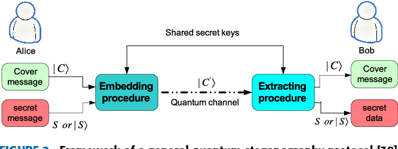

## Quantum_Steganography
- 

# Introduction

Steganography  is  a  technique  hiding  secret  information  within  innocent-looking  information  (e.g.,  text,  audio,  image,  video, and so on). In this project, we propose a quantum steganography protocol using plain text as innocent-looking in-formation called cover data. 
The data is encoded to the quantum circuit using Breinstein Vazirani Algorithm.
Stego data is constructed by modifying cover data, i.e.,  stego  data  is  made  by  embedding a secret message to cover data. To encode/decode the data, we use symmetric encryption, here we used XOR operation (we can replace it by a more complex hash functions).
The communication channel is secured using BB84 protocol, that can prevent the attacker to decode the hidden message without knowing the key.
# Advantages over cryptography

Steganography is distinct from cryptography, but using both together can help improve the security of the protected information and prevent detection of the secret communication. If steganographically-hidden data is also encrypted, the data may still be safe from detection -- though the channel will no longer be safe from detection. There are advantages to using steganography combined with encryption over encryption-only communication.

The primary advantage of using steganography to hide data over encryption is that it helps obscure the fact that there is sensitive data hidden in the file or other content carrying the hidden text. Whereas an encrypted file, message or network packet payload is clearly marked and identifiable as such, using steganographic techniques helps to obscure the presence of the secure channel.

# QC Hack
- This project was submitted to the QCHack Hackthon, we won the Grand prize for the IBM Creative Challenge.
- [Presentation](https://www.canva.com/design/DAEbXXyw0fU/view)

# Deployed Application
https://qc-hacks.herokuapp.com

